# PRFlow Architecture

This document provides a comprehensive overview of PRFlow's system architecture, including component design, data flow, and technical decisions.

## Table of Contents

- [System Overview](#system-overview)
- [Multi-Agent Architecture](#multi-agent-architecture)
- [Data Flow](#data-flow)
- [Component Design](#component-design)
- [Database Schema](#database-schema)
- [Security Architecture](#security-architecture)
- [Scalability Considerations](#scalability-considerations)
- [Technology Stack](#technology-stack)

---

## System Overview

PRFlow is built as a modular, event-driven platform that processes pull requests through a pipeline of specialized AI agents. The architecture emphasizes:

- **Parallelism**: Agents run concurrently where possible
- **Resilience**: Failed jobs can be retried without losing progress
- **Scalability**: Horizontal scaling via job queues
- **Extensibility**: New agents can be added without modifying core logic

### High-Level Architecture


---

## Multi-Agent Architecture

PRFlow uses a multi-agent system where specialized agents handle different aspects of code review. This design allows for:

- **Separation of concerns**: Each agent focuses on one task
- **Parallel execution**: Independent agents run concurrently
- **Easy extension**: New capabilities via new agents
- **Customization**: Agents can be enabled/disabled per repository

### Agent Hierarchy

```mermaid
flowchart TB
    subgraph Core["Core Agents"]
        Analyzer[🔍 Analyzer Agent]
        Reviewer[🐛 Reviewer Agent]
        TestGen[🧪 Test Generator]
        DocGen[📝 Documentation Agent]
        Synthesis[📋 Synthesis Agent]
    end

    subgraph Advanced["Advanced Agents"]
        Compliance[🔐 Compliance Agent]
        Intent[🎯 Intent Agent]
        Migration[🔄 Migration Agent]
        Decomposition[✂️ Decomposition Agent]
        KnowledgeGraph[🧠 Knowledge Graph Agent]
    end

    subgraph Specialized["Specialized Agents"]
        PairReviewer[👥 Pair Reviewer]
        DebtDashboard[📊 Debt Dashboard]
        Personas[🎭 Review Personas]
        PredictiveCI[⚡ Predictive CI]
        NLQuery[💬 NL Query Agent]
    end

    subgraph Orchestration["Orchestration"]
        MultiRepo[🔗 Multi-Repo Agent]
        Collaborative[🤝 Collaborative Review]
        LearningPaths[🎓 Learning Paths]
    end
```



### Agent Execution Flow


### Agent Interface

All agents implement a common interface:

```typescript
interface Agent<TInput, TOutput> {
  name: string;
  version: string;

  execute(input: TInput, context: AgentContext): Promise<AgentResult<TOutput>>;

  validate?(input: TInput): ValidationResult;
  cleanup?(): Promise<void>;
}

interface AgentContext {
  repositoryId: string;
  workflowId: string;
  installationId: number;
  config: RepositorySettings;
  logger: Logger;
}

interface AgentResult<T> {
  success: boolean;
  data?: T;
  error?: string;
  metrics?: {
    latencyMs: number;
    tokensUsed?: number;
  };
}
```

---

## Data Flow

### PR Processing Pipeline


### Workflow State Machine


### Job Queue Architecture


---

## Component Design

### API Layer

```mermaid
flowchart TB
    subgraph API["Fastify API Server"]
        Router[Router]

        subgraph Middleware
            Auth[Authentication]
            RateLimit[Rate Limiting]
            Validation[Request Validation]
            ErrorHandler[Error Handler]
        end

        subgraph Routes
            Health[/health]
            Repos[/repositories]
            Workflows[/workflows]
            Analytics[/analytics]
            Enterprise[/enterprise]
        end

        subgraph Plugins
            Prisma[Prisma Plugin]
            Redis[Redis Plugin]
            WebSocket[WebSocket Plugin]
        end
    end

    Router --> Auth
    Auth --> RateLimit
    RateLimit --> Validation
    Validation --> Routes
    Routes --> Plugins
    ErrorHandler -.->|Catches| Routes
```

### Service Layer


### Frontend Architecture


---

## Database Schema

### Entity Relationship Diagram

```mermaid
erDiagram
    Organization ||--o{ Team : has
    Organization ||--o{ Repository : owns

    Team ||--o{ TeamMember : has
    Team ||--o| Subscription : has

    User ||--o{ TeamMember : belongs_to
    User ||--o{ Session : has

    Repository ||--o{ PRWorkflow : processes
    Repository ||--o| RepositorySettings : has
    Repository ||--o{ TestPattern : defines

    PRWorkflow ||--o| PRAnalysis : produces
    PRWorkflow ||--o{ ReviewComment : generates
    PRWorkflow ||--o{ GeneratedTest : creates
    PRWorkflow ||--o{ DocUpdate : suggests
    PRWorkflow ||--o| PRSynthesis : summarizes

    ReviewComment ||--o{ FixApplication : has

    Organization {
        string id PK
        int githubId UK
        string login UK
        string name
        int installationId UK
    }

    Team {
        string id PK
        string name
        string organizationId FK
        json settings
    }

    User {
        string id PK
        int githubId UK
        string login UK
        string name
        string email
    }

    Repository {
        string id PK
        int githubId UK
        string fullName UK
        string owner
        string defaultBranch
        boolean isPrivate
    }

    PRWorkflow {
        string id PK
        string repositoryId FK
        int prNumber
        string status
        datetime startedAt
        datetime completedAt
    }

    PRAnalysis {
        string id PK
        string workflowId FK UK
        enum prType
        enum riskLevel
        int filesModified
        json semanticChanges
    }

    ReviewComment {
        string id PK
        string workflowId FK
        string file
        int line
        enum severity
        enum category
        string message
        json suggestion
    }
```

### Key Tables

| Table | Purpose | Key Fields |
|-------|---------|------------|
| `organizations` | GitHub organizations | githubId, installationId |
| `teams` | Team management | organizationId, settings |
| `users` | User accounts | githubId, login, email |
| `repositories` | Connected repos | githubId, fullName, settings |
| `pr_workflows` | PR processing state | repositoryId, prNumber, status |
| `pr_analyses` | Analysis results | workflowId, prType, riskLevel |
| `review_comments` | Generated comments | workflowId, severity, category |
| `generated_tests` | Auto-generated tests | workflowId, testCode, framework |
| `fix_applications` | Applied fixes | commentId, commitSha, status |

---

## Security Architecture

### Authentication Flow


### Security Layers


---

## Scalability Considerations

### Horizontal Scaling


### Caching Strategy

| Layer | Technology | TTL | Purpose |
|-------|------------|-----|---------|
| API Response | Redis | 5 min | Repeated queries |
| Knowledge Graph | Redis | 1 hour | Graph data |
| User Sessions | Redis | 24 hours | Auth state |
| ML Models | Memory | Indefinite | Inference speed |
| GitHub API | Redis | 1 min | Rate limit protection |

### Performance Targets

| Metric | Target | Current |
|--------|--------|---------|
| API Latency (p99) | < 200ms | ~150ms |
| Workflow Start Time | < 5s | ~3s |
| Analysis Time (small PR) | < 30s | ~20s |
| Analysis Time (large PR) | < 2min | ~90s |
| Concurrent Workflows | 1000+ | 500+ |

---

## Technology Stack

### Core Technologies


### Package Dependencies

| Category | Package | Version | Purpose |
|----------|---------|---------|---------|
| Framework | Fastify | 4.26.0 | API server |
| ORM | Prisma | 5.10.0 | Database access |
| Queue | BullMQ | 5.1.0 | Job processing |
| Cache | ioredis | 5.3.0 | Redis client |
| Logging | Pino | 8.18.0 | Structured logging |
| Validation | Zod | 3.22.0 | Schema validation |
| GitHub | Octokit | 3.x | GitHub API |
| Frontend | Next.js | 15.1.0 | React framework |
| Styling | Tailwind | 3.4.1 | CSS framework |

### Monorepo Structure


---

## Deployment Architecture

### Production Deployment


---

## Future Considerations

### Planned Improvements

1. **Event Sourcing**: Move to event-sourced architecture for better auditability
2. **GraphQL API**: Add GraphQL layer for flexible querying
3. **Plugin System**: Allow custom agents via plugin architecture
4. **Multi-Region**: Deploy across regions for lower latency
5. **Streaming**: Real-time streaming of analysis results

### Technical Debt

- [ ] Migrate to ESM-only modules
- [ ] Add OpenTelemetry tracing
- [ ] Implement circuit breakers for external services
- [ ] Add comprehensive E2E test suite
- [ ] Implement proper feature flags system
