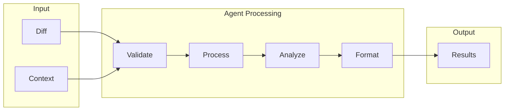
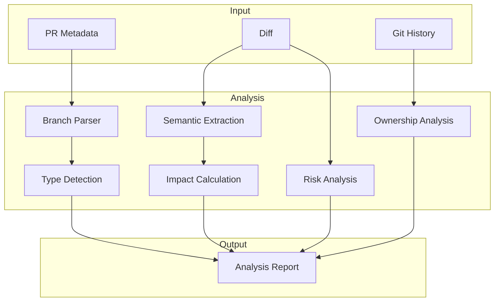
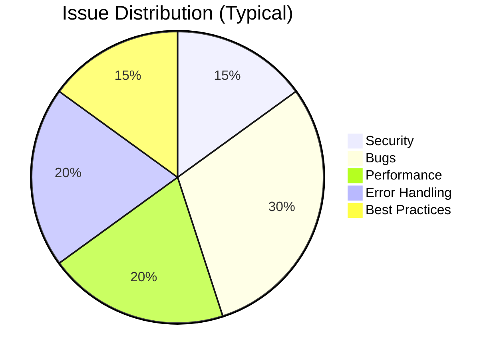
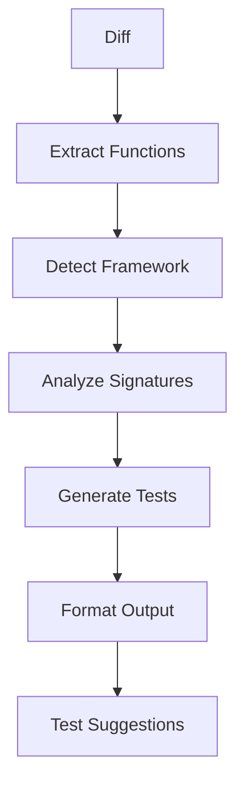
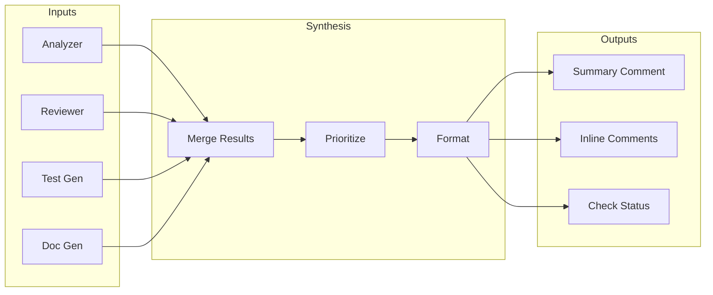

# Agents

PRFlow uses specialized AI agents that work together to analyze, review, and improve pull requests. Each agent focuses on a specific task, enabling parallel processing and deep expertise.

## How Agents Work

All agents follow a common pattern:



**Key characteristics:**
- **Stateless** — Each run is independent
- **Deterministic** — Same input produces same output (without LLM)
- **Configurable** — Enable/disable features per agent
- **Fast-failing** — Validates input before processing

---

## Analyzer Agent

The Analyzer creates a structured understanding of what changed and why it matters. It runs first and provides context for other agents.

### Capabilities

| Feature | Description |
|---------|-------------|
| **PR Type Detection** | Classifies as feature, bugfix, refactor, docs, chore, test, or deps |
| **Semantic Analysis** | Identifies new functions, modified APIs, config changes |
| **Impact Calculation** | Finds affected files and dependent code |
| **Risk Assessment** | Flags changes to sensitive files, auth, database |
| **Reviewer Suggestions** | Recommends reviewers based on code ownership |

### How It Works



### PR Type Detection

PRFlow classifies PRs based on multiple signals:

**1. Branch name patterns:**

| Pattern | Detected Type |
|---------|---------------|
| `feature/*`, `feat/*` | feature |
| `fix/*`, `bugfix/*`, `hotfix/*` | bugfix |
| `refactor/*` | refactor |
| `docs/*`, `documentation/*` | docs |
| `chore/*`, `ci/*`, `build/*` | chore |
| `test/*`, `tests/*` | test |
| `deps/*`, `dependencies/*` | deps |

**2. Changed file analysis:**
- Only `.md` files → `docs`
- Only test files → `test`
- Package manager files → `deps`
- Code + tests → `feature` or `bugfix`

**3. Commit message patterns:**
- Conventional commits (`feat:`, `fix:`, etc.)
- Keywords in title

### Semantic Changes

The Analyzer extracts structured information about what changed:

```typescript
interface SemanticChange {
  type: 'function' | 'class' | 'export' | 'import' | 'config' | 'schema';
  action: 'added' | 'modified' | 'removed' | 'renamed';
  name: string;
  file: string;
  breaking: boolean;
  details?: {
    oldSignature?: string;
    newSignature?: string;
    visibility?: 'public' | 'internal' | 'private';
  };
}
```

**Example output:**

```json
{
  "semanticChanges": [
    {
      "type": "function",
      "action": "added",
      "name": "validateEmail",
      "file": "src/utils/validation.ts",
      "breaking": false
    },
    {
      "type": "export",
      "action": "modified", 
      "name": "UserService",
      "file": "src/services/index.ts",
      "breaking": true,
      "details": {
        "oldSignature": "class UserService",
        "newSignature": "class UserService extends BaseService"
      }
    }
  ]
}
```

### Risk Assessment

Changes are scored based on:

| Factor | Weight | Examples |
|--------|--------|----------|
| Sensitive files | High | `.env`, auth modules, payment code |
| Large diffs | Medium | >500 lines changed |
| Database changes | High | Migrations, schema files |
| API changes | Medium | Route handlers, public interfaces |
| Config changes | Medium | Environment, build config |

**Risk levels:**

| Level | Description | Typical Causes |
|-------|-------------|----------------|
| `low` | Minimal review needed | Docs, small fixes |
| `medium` | Standard review | New features, refactors |
| `high` | Extra scrutiny | Auth, security, payments |
| `critical` | Multiple senior reviewers | Database migrations, breaking changes |

### Configuration

```yaml
# .github/prflow.yml
agents:
  analyzer:
    enabled: true
    
    # PR type detection
    classify_pr_type: true
    branch_prefixes:
      feature: ['feature/', 'feat/']
      bugfix: ['fix/', 'hotfix/', 'bugfix/']
    
    # Impact analysis
    calculate_impact: true
    impact_depth: 2  # How many levels of dependents to trace
    
    # Risk assessment
    risk_assessment: true
    sensitive_paths:
      - '**/auth/**'
      - '**/payment/**'
      - '**/.env*'
      - '**/migrations/**'
    
    # Reviewer suggestions
    suggest_reviewers: true
    max_reviewers: 3
```

---

## Reviewer Agent

The Reviewer performs automated code review to find bugs, security issues, and quality problems that humans often miss.

### Detection Categories



#### Security Issues

| Issue | Severity | Detection Method |
|-------|----------|------------------|
| SQL Injection | Critical | Pattern + LLM |
| XSS Vulnerabilities | Critical | Pattern + LLM |
| Hardcoded Secrets | Critical | Pattern (regex) |
| Insecure Crypto | High | Pattern |
| Path Traversal | High | Pattern + LLM |
| CORS Misconfiguration | Medium | Pattern |

**Example detection:**

```javascript
// ❌ Detected: SQL injection vulnerability
const query = `SELECT * FROM users WHERE id = ${userId}`;

// ✅ Suggested fix
const query = 'SELECT * FROM users WHERE id = $1';
const result = await db.query(query, [userId]);
```

#### Bug Detection

| Issue | Severity | Detection Method |
|-------|----------|------------------|
| Null/Undefined Access | High | Pattern + LLM |
| Off-by-One Errors | Medium | LLM |
| Race Conditions | High | Pattern + LLM |
| Resource Leaks | Medium | Pattern |
| Incorrect Type Handling | Medium | Pattern |
| Logic Errors | Varies | LLM |

**Example detection:**

```javascript
// ❌ Detected: Possible null dereference
function processUser(user) {
  return user.profile.avatar.url;  // What if profile or avatar is null?
}

// ✅ Suggested fix
function processUser(user) {
  return user?.profile?.avatar?.url ?? null;
}
```

#### Performance Issues

| Issue | Severity | Detection Method |
|-------|----------|------------------|
| N+1 Queries | High | Pattern + LLM |
| Memory Leaks | High | Pattern |
| Blocking I/O | Medium | Pattern |
| Unnecessary Re-renders | Medium | Pattern + LLM |
| Large Bundle Imports | Low | Pattern |

**Example detection:**

```javascript
// ❌ Detected: N+1 query pattern
for (const user of users) {
  const posts = await db.posts.findMany({ where: { userId: user.id } });
}

// ✅ Suggested fix
const userIds = users.map(u => u.id);
const posts = await db.posts.findMany({ where: { userId: { in: userIds } } });
const postsByUser = groupBy(posts, 'userId');
```

#### Error Handling

| Issue | Severity | Detection Method |
|-------|----------|------------------|
| Empty Catch Blocks | Medium | Pattern |
| Unhandled Promises | High | Pattern |
| Missing Error Boundaries | Medium | Pattern |
| Silent Failures | Medium | LLM |
| Generic Error Messages | Low | Pattern |

### Comment Format

Review comments follow a consistent structure:

```typescript
interface ReviewComment {
  file: string;
  line: number;
  endLine?: number;
  
  severity: 'critical' | 'high' | 'medium' | 'low' | 'nitpick';
  category: 'security' | 'bug' | 'performance' | 'error_handling' | 'style';
  
  message: string;
  explanation?: string;
  
  suggestion?: {
    description: string;
    originalCode: string;
    suggestedCode: string;
  };
  
  confidence: number;  // 0-1, filters low-confidence findings
  reference?: string;  // Link to documentation or best practice
}
```

### Configuration

```yaml
# .github/prflow.yml
agents:
  reviewer:
    enabled: true
    
    # Categories (all enabled by default)
    security:
      enabled: true
      severity_threshold: 'low'  # Report all security issues
    
    bugs:
      enabled: true
      severity_threshold: 'medium'
    
    performance:
      enabled: true
      severity_threshold: 'medium'
    
    error_handling:
      enabled: true
      severity_threshold: 'medium'
    
    style:
      enabled: false  # Optional, disabled by default
    
    # Filtering
    min_confidence: 0.7  # Don't report low-confidence findings
    max_comments: 20     # Limit comment volume
    
    # Paths to skip
    ignore_patterns:
      - '**/*.test.ts'
      - '**/*.spec.ts'
      - '**/fixtures/**'
      - '**/mocks/**'
```

---

## Test Generator Agent

The Test Generator analyzes new and modified code, then suggests unit tests to improve coverage.

### Workflow



### Supported Frameworks

| Language | Frameworks | Auto-Detect |
|----------|------------|-------------|
| JavaScript/TypeScript | Jest, Vitest, Mocha | package.json scripts |
| Python | pytest, unittest | pyproject.toml, setup.cfg |
| Go | testing, testify | go.mod |

### Test Generation Strategy

For each new or modified function, PRFlow generates:

1. **Happy path tests** — Normal use cases
2. **Edge case tests** — Boundary conditions
3. **Error tests** — Invalid inputs, failure modes
4. **Integration hints** — Suggestions for testing with dependencies

**Example input:**

```typescript
// src/utils/validation.ts
export function validateEmail(email: string): boolean {
  const regex = /^[^\s@]+@[^\s@]+\.[^\s@]+$/;
  return regex.test(email);
}
```

**Generated tests:**

```typescript
// src/utils/validation.test.ts
import { validateEmail } from './validation';

describe('validateEmail', () => {
  // Happy path
  it('should return true for valid email', () => {
    expect(validateEmail('user@example.com')).toBe(true);
  });

  it('should return true for email with subdomain', () => {
    expect(validateEmail('user@mail.example.com')).toBe(true);
  });

  // Edge cases
  it('should return false for email without domain', () => {
    expect(validateEmail('user@')).toBe(false);
  });

  it('should return false for email without @', () => {
    expect(validateEmail('userexample.com')).toBe(false);
  });

  // Error cases
  it('should return false for empty string', () => {
    expect(validateEmail('')).toBe(false);
  });

  it('should return false for email with spaces', () => {
    expect(validateEmail('user @example.com')).toBe(false);
  });
});
```

### Configuration

```yaml
# .github/prflow.yml
agents:
  test_generator:
    enabled: true
    
    # Framework (auto-detect or specify)
    framework: auto  # or 'jest', 'vitest', 'pytest', 'go'
    
    # Test types to generate
    happy_path: true
    edge_cases: true
    error_cases: true
    
    # Output
    inline_suggestions: true  # Show in PR comments
    full_file_output: false   # Generate complete test files
    
    # Filtering
    min_function_complexity: 2  # Skip trivial functions
    ignore_patterns:
      - '**/*.d.ts'
      - '**/types/**'
```

---

## Documentation Agent

The Documentation agent keeps docs in sync with code changes by detecting gaps and suggesting updates.

### Capabilities

| Feature | Description |
|---------|-------------|
| **JSDoc/Docstring** | Generate documentation for public APIs |
| **README Updates** | Detect when README needs updating |
| **Changelog Entries** | Suggest changelog updates |
| **API Docs** | Flag undocumented endpoints |

### Detection Modes

**1. Missing Documentation**

```typescript
// ❌ Detected: Missing JSDoc for exported function
export function calculateTax(amount: number, rate: number): number {
  return amount * rate;
}

// ✅ Suggested:
/**
 * Calculate tax amount.
 * @param amount - The base amount to tax
 * @param rate - The tax rate (e.g., 0.08 for 8%)
 * @returns The calculated tax amount
 */
export function calculateTax(amount: number, rate: number): number {
  return amount * rate;
}
```

**2. Outdated Documentation**

```typescript
// ❌ Detected: Documentation doesn't match signature
/**
 * Get user by ID.
 * @param id - User ID
 */
export function getUser(id: string, options?: GetUserOptions): Promise<User> {
  // Function has new `options` param not documented
}
```

**3. Changelog Suggestions**

When semantic changes are detected, the agent suggests changelog entries:

```markdown
## [Unreleased]

### Added
- `calculateTax` function for tax calculations
- `options` parameter to `getUser` for filtering

### Changed
- `UserService` now extends `BaseService`

### Deprecated
- `oldValidation` function, use `validateEmail` instead
```

### Configuration

```yaml
# .github/prflow.yml
agents:
  documentation:
    enabled: true
    
    # What to check
    jsdoc:
      enabled: true
      require_public: true      # Only public exports
      require_params: true      # Require @param tags
      require_returns: true     # Require @returns tag
    
    readme:
      enabled: true
      track_exports: true       # Flag new public APIs
    
    changelog:
      enabled: true
      format: 'keepachangelog'  # or 'conventional'
```

---

## Synthesis Agent

The Synthesis agent combines outputs from all other agents into a coherent summary.

### Responsibilities



### Summary Format

```markdown
## PRFlow Analysis

### Summary
This PR adds email validation to the user signup flow.

**Type:** Feature | **Risk:** Low | **Size:** +127 / -12

### Findings
- 🔴 1 security issue
- 🟡 2 performance suggestions
- 🔵 3 tests recommended

### Key Changes
- Added `validateEmail` function
- Modified `UserService.signup` method
- Added email regex pattern

### Suggested Reviewers
- @alice (auth owner)
- @bob (validation expert)

[View detailed analysis →](#details)
```

### Check Status Logic

| Condition | Check Status |
|-----------|--------------|
| Critical issues found | Failure |
| High severity issues | Failure (configurable) |
| Medium/low issues only | Success with warnings |
| No issues | Success |

---

## Custom Agents

You can create custom agents by extending the `BaseAgent` class:

```typescript
import { BaseAgent, AgentContext, AgentResult } from '@prflow/core';

interface MyInput {
  pr: PullRequest;
  diff: Diff;
}

interface MyOutput {
  findings: Finding[];
}

class ComplianceAgent extends BaseAgent<MyInput, MyOutput> {
  readonly name = 'compliance-checker';
  readonly description = 'Check for regulatory compliance';

  async execute(input: MyInput, context: AgentContext): Promise<AgentResult<MyOutput>> {
    const { result, latencyMs } = await this.measureExecution(async () => {
      // Check for PCI-DSS, HIPAA, GDPR compliance issues
      const findings = await this.checkCompliance(input.diff);
      return { findings };
    });

    return this.createSuccessResult(result, latencyMs);
  }

  private async checkCompliance(diff: Diff): Promise<Finding[]> {
    // Your compliance logic here
    return [];
  }
}
```

### Registering Custom Agents

```typescript title="prflow.config.ts"
import { ComplianceAgent } from './agents/compliance';

export default {
  customAgents: [
    new ComplianceAgent(),
  ],
};
```

---

## LLM Integration

Agents can use LLMs for enhanced analysis:

```bash
# Enable LLM-powered features
ENABLE_LLM_ANALYSIS=true
ENABLE_LLM_REVIEW=true
ENABLE_LLM_TESTS=true

# Configure LLM provider
LLM_PROVIDER=openai
OPENAI_API_KEY=sk-...
```

### Fallback Behavior

When LLM is disabled or unavailable:
- Pattern-based analysis runs as fallback
- Results are less comprehensive but faster
- No external API calls required
- Deterministic and reproducible

---

## Next Steps

- [**Architecture**](/docs/concepts/architecture) — System overview
- [**Workflows**](/docs/concepts/workflows) — Customize processing
- [**Configuration**](/docs/guides/configuration) — All config options
