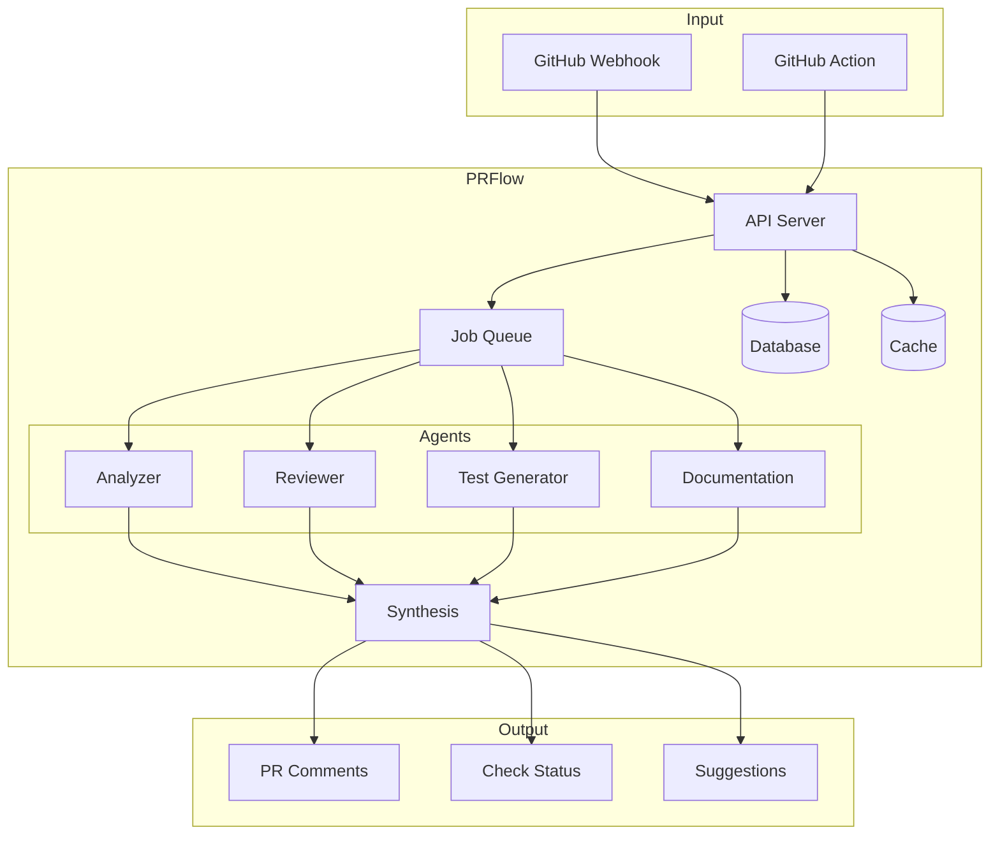
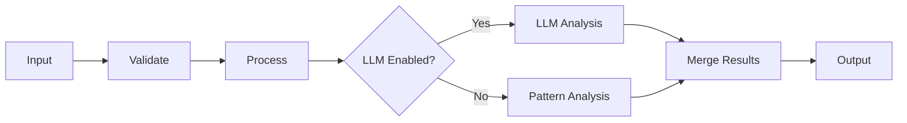
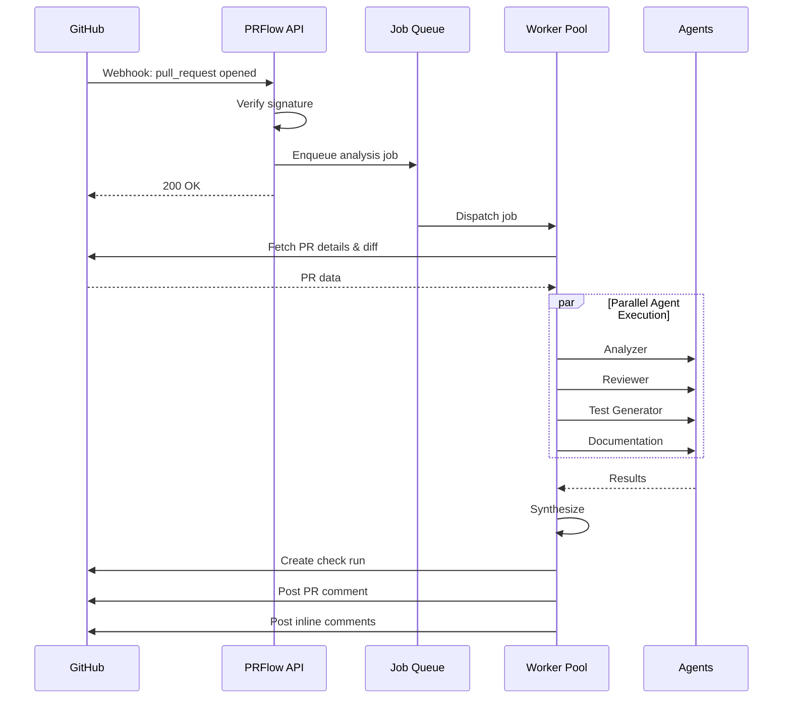
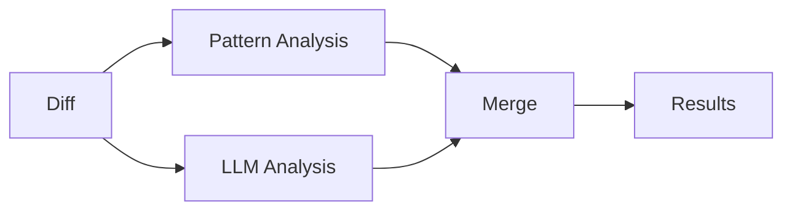
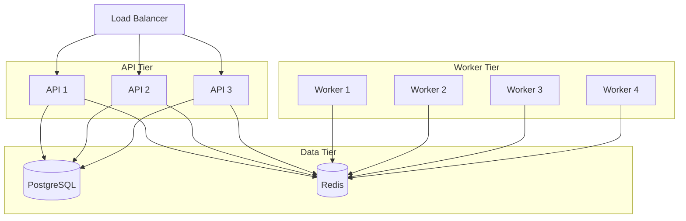

# Architecture

PRFlow uses a multi-agent architecture where specialized AI agents work in parallel to analyze different aspects of a pull request.

## System Overview



## Core Components

### API Server

The API server handles:
- Webhook reception from GitHub
- Job queuing and orchestration
- Authentication and authorization
- REST API for dashboard and integrations

**Technology:** Fastify (Node.js)

```typescript
// Webhook handler example
app.post('/api/webhooks/github', async (request, reply) => {
  const event = request.headers['x-github-event'];
  const payload = request.body;
  
  if (event === 'pull_request') {
    await jobQueue.add('analyze-pr', {
      action: payload.action,
      pullRequest: payload.pull_request,
      repository: payload.repository,
    });
  }
  
  return { received: true };
});
```

### Job Queue

Handles asynchronous processing:
- Receives analysis jobs from API
- Distributes work to agent workers
- Manages retries and failures
- Tracks job status

**Technology:** BullMQ + Redis

```typescript
// Job processing
const worker = new Worker('analyze-pr', async (job) => {
  const { pullRequest, repository } = job.data;
  
  // Run agents in parallel
  const [analysis, review, tests, docs] = await Promise.all([
    analyzerAgent.execute(pullRequest),
    reviewerAgent.execute(pullRequest),
    testGenAgent.execute(pullRequest),
    docAgent.execute(pullRequest),
  ]);
  
  // Synthesize results
  return synthesisAgent.combine({ analysis, review, tests, docs });
});
```

### Database

Stores:
- Repository configurations
- Workflow history
- Analytics data
- User sessions

**Technology:** PostgreSQL + Prisma

### Cache

Speeds up:
- GitHub API responses
- Frequently accessed data
- Rate limit management

**Technology:** Redis

---

## Agent Architecture

Each agent follows a consistent pattern:



### Base Agent Interface

```typescript
interface Agent<TInput, TOutput> {
  name: string;
  description: string;
  
  execute(
    input: TInput, 
    context: AgentContext
  ): Promise<AgentResult<TOutput>>;
}

interface AgentResult<T> {
  success: boolean;
  data?: T;
  error?: string;
  latencyMs: number;
}
```

### Analyzer Agent

**Purpose:** Understand what changed and assess risk.

**Input:**
- Pull request metadata
- Diff content
- Repository context

**Output:**
```typescript
interface PRAnalysis {
  type: 'feature' | 'bugfix' | 'refactor' | 'docs' | 'chore' | 'test' | 'deps';
  riskLevel: 'low' | 'medium' | 'high' | 'critical';
  semanticChanges: SemanticChange[];
  impactRadius: {
    directDependents: number;
    transitiveDependents: number;
    affectedFiles: string[];
  };
  risks: string[];
  suggestedReviewers: Reviewer[];
}
```

**How it works:**
1. Parse branch name for PR type hints (`feature/`, `fix/`, etc.)
2. Analyze file changes for semantic meaning
3. Detect new/modified functions, APIs, configs
4. Calculate impact based on change location
5. Assess risk based on size, complexity, sensitive files
6. Suggest reviewers based on code ownership

### Reviewer Agent

**Purpose:** Find bugs, security issues, and code quality problems.

**Categories checked:**

| Category | Examples |
|----------|----------|
| Security | SQL injection, XSS, hardcoded secrets |
| Bugs | Null pointers, off-by-one, race conditions |
| Performance | N+1 queries, memory leaks, blocking I/O |
| Error Handling | Empty catch, unhandled promises |
| Style | Naming, complexity, maintainability |

**Output:**
```typescript
interface ReviewResult {
  comments: ReviewComment[];
  summary: {
    critical: number;
    high: number;
    medium: number;
    low: number;
    nitpick: number;
  };
  autoFixed: string[];
}

interface ReviewComment {
  file: string;
  line: number;
  severity: Severity;
  category: Category;
  message: string;
  suggestion?: {
    originalCode: string;
    suggestedCode: string;
  };
  confidence: number;
}
```

**How it works:**
1. **Pattern matching** — Fast regex-based detection for known issues
2. **LLM analysis** — Deeper semantic understanding (if enabled)
3. **Deduplication** — Merge similar issues
4. **Confidence scoring** — Rate certainty of each finding
5. **Suggestion generation** — Provide actionable fixes

### Test Generator Agent

**Purpose:** Suggest tests for new and modified code.

**Supported frameworks:**
- Jest / Vitest (JavaScript/TypeScript)
- pytest (Python)
- Go testing (Go)

**Output:**
```typescript
interface TestGenerationResult {
  tests: GeneratedTest[];
  frameworkDetected: TestFramework;
  coverageImprovement: number | null;
}

interface GeneratedTest {
  testFile: string;
  targetFile: string;
  testCode: string;
  testNames: string[];
  coverageTargets: string[];
}
```

**How it works:**
1. Detect test framework from project files
2. Extract new/modified functions from diff
3. Generate test cases:
   - Happy path tests
   - Edge cases
   - Error handling
4. Match project's testing style

### Documentation Agent

**Purpose:** Keep docs in sync with code.

**What it does:**
- Generate JSDoc for public APIs
- Flag outdated README sections
- Suggest changelog entries
- Detect missing documentation

### Synthesis Agent

**Purpose:** Combine all agent outputs into a coherent report.

**Responsibilities:**
1. Merge and deduplicate findings
2. Prioritize by severity and confidence
3. Generate human-readable summary
4. Format for GitHub comments and checks

---

## Processing Pipeline



### Timing

Typical processing time: **30-60 seconds**

| Stage | Time |
|-------|------|
| Webhook → Job queued | < 100ms |
| Fetch PR data | 200-500ms |
| Agent execution (parallel) | 10-40s |
| Synthesis | < 1s |
| Post to GitHub | 500ms-2s |

---

## LLM Integration

PRFlow can use LLMs for enhanced analysis. When enabled:



### Configuration

```bash
# Enable/disable LLM features
ENABLE_LLM_ANALYSIS=true
ENABLE_LLM_REVIEW=true
ENABLE_LLM_TESTS=true

# Provider (openai, anthropic)
LLM_PROVIDER=openai
OPENAI_API_KEY=sk-...
```

### Fallback Behavior

If LLM is disabled or fails:
- Pattern-based analysis still runs
- Results are less comprehensive but faster
- No external API calls required

---

## Scaling

### Horizontal Scaling



**API servers:** Stateless, scale based on request volume

**Workers:** Scale based on queue depth

**Database:** Standard PostgreSQL scaling (read replicas, connection pooling)

**Redis:** Cluster mode for high availability

### Recommended Setup

| Scale | API Instances | Workers | PostgreSQL | Redis |
|-------|---------------|---------|------------|-------|
| Small (up to 100 repos) | 1 | 2 | Single | Single |
| Medium (up to 1000 repos) | 2-3 | 4-8 | Primary + Replica | Single |
| Large (1000+ repos) | 3+ | 8+ | Cluster | Cluster |

---

## Next Steps

- [**Agents**](/docs/concepts/agents) — Deep dive into each agent
- [**Workflows**](/docs/concepts/workflows) — Customize the processing pipeline
- [**Self-Hosting**](/docs/guides/self-hosting) — Deploy your own instance
