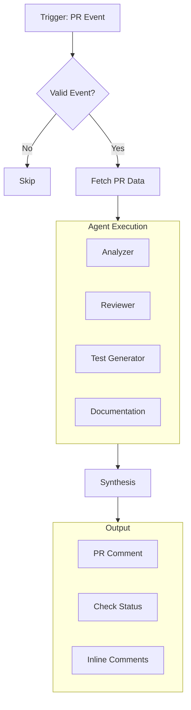
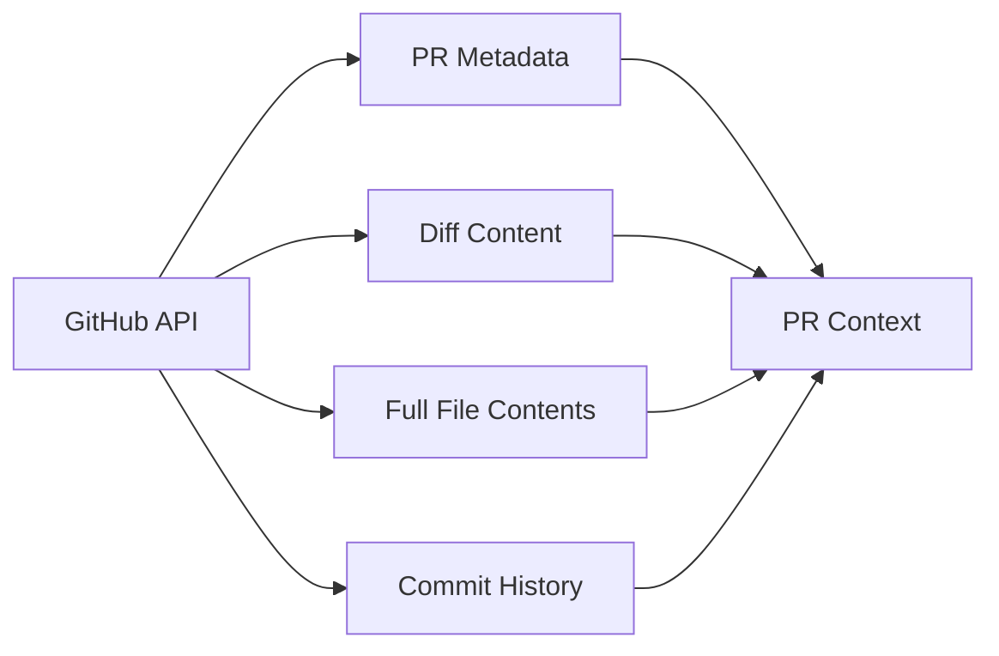
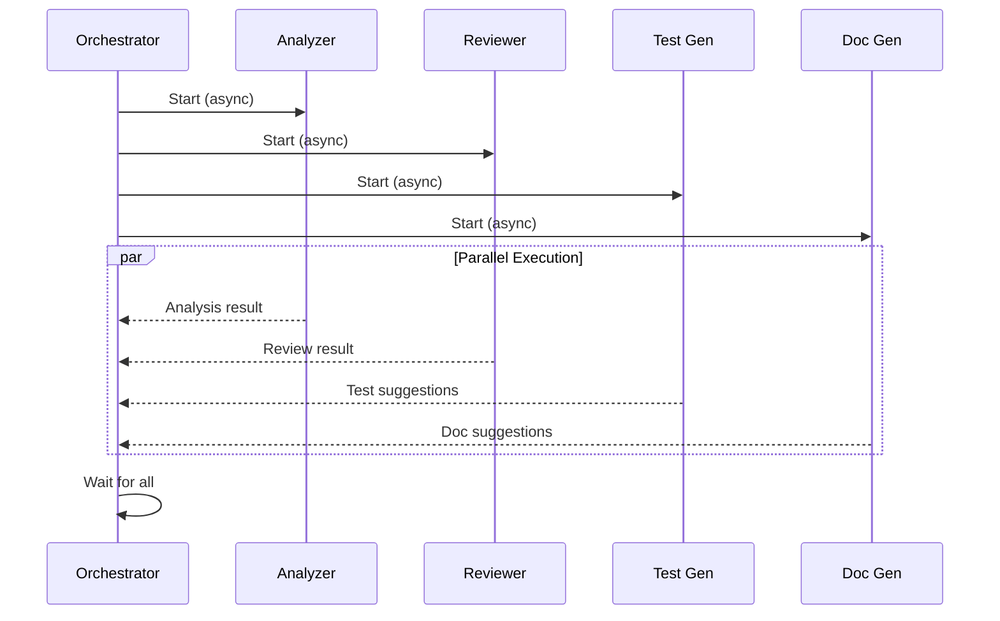
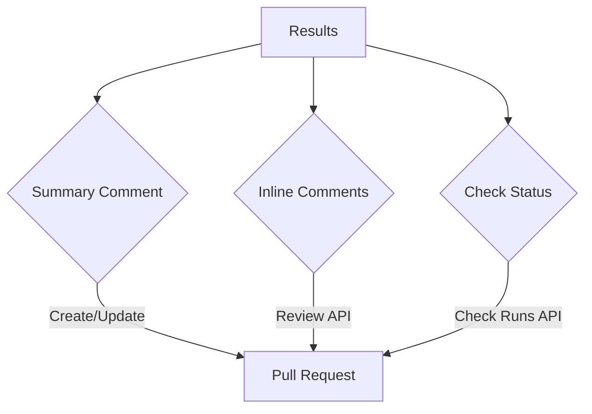
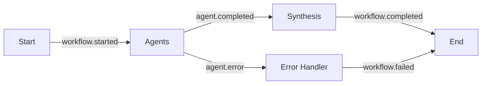

# Workflows

A workflow defines how PRFlow processes a pull request—which agents run, in what order, and what happens with their results.

## Default Workflow

Out of the box, PRFlow runs this workflow for every PR:



### Trigger Events

| Event | Default Action |
|-------|----------------|
| `pull_request.opened` | Full analysis |
| `pull_request.synchronize` | Full analysis (new commits) |
| `pull_request.reopened` | Full analysis |
| `pull_request.ready_for_review` | Full analysis |
| `pull_request.edited` | Skip (title/description change only) |
| `issue_comment.created` | Check for commands |

---

## Configuring Workflows

### Basic Configuration

```yaml
# .github/prflow.yml
workflow:
  # When to run
  triggers:
    - pull_request.opened
    - pull_request.synchronize
  
  # Which agents to run
  agents:
    analyzer: true
    reviewer: true
    test_generator: true
    documentation: false  # Disable doc suggestions
  
  # What to output
  outputs:
    summary_comment: true
    inline_comments: true
    check_status: true
```

### Conditional Execution

Run different workflows based on PR characteristics:

```yaml
# .github/prflow.yml
workflows:
  # Full review for feature branches
  feature:
    condition:
      branch_pattern: 'feature/*'
    agents:
      analyzer: true
      reviewer: true
      test_generator: true
      documentation: true

  # Quick review for bugfixes
  bugfix:
    condition:
      branch_pattern: 'fix/*'
    agents:
      analyzer: true
      reviewer:
        categories: [security, bug]  # Only critical categories
      test_generator: false
      documentation: false

  # Skip review for dependency updates
  deps:
    condition:
      branch_pattern: 'deps/*'
      files: ['package.json', 'pnpm-lock.yaml']
    skip: true

  # Skip draft PRs
  draft:
    condition:
      draft: true
    skip: true
```

### Path-Based Rules

Enable agents only when specific paths are changed:

```yaml
# .github/prflow.yml
workflow:
  agents:
    reviewer:
      enabled: true
      paths:
        include:
          - 'src/**'
          - 'lib/**'
        exclude:
          - '**/*.test.ts'
          - '**/*.spec.ts'
    
    test_generator:
      enabled: true
      paths:
        include:
          - 'src/**'  # Only suggest tests for source code
    
    documentation:
      enabled: true
      paths:
        include:
          - 'src/api/**'  # Only check API docs
```

### Size-Based Rules

Adjust behavior based on PR size:

```yaml
# .github/prflow.yml
workflow:
  size_limits:
    small:
      max_files: 5
      max_lines: 100
      agents:
        analyzer: true
        reviewer: true
        test_generator: false  # Skip for tiny PRs
    
    large:
      min_files: 20
      min_lines: 1000
      agents:
        analyzer: true
        reviewer:
          max_comments: 10  # Limit noise on large PRs
        test_generator: false
      outputs:
        inline_comments: false  # Summary only for large PRs
```

---

## Workflow Stages

### 1. Trigger Stage

PRFlow receives events via webhook or GitHub Action.

**Validation checks:**
- Is this an event we handle?
- Is the repository configured?
- Should we skip this PR (draft, excluded path, etc.)?

### 2. Fetch Stage

PRFlow gathers all necessary data:



**Fetched data:**
- PR metadata (title, description, labels, author)
- Diff content (changed files, hunks)
- Full file contents (for context-aware analysis)
- Commit history (for ownership analysis)
- Repository info (language, framework detection)

### 3. Agent Execution Stage

Agents run in parallel where possible:



**Execution modes:**

| Mode | Description | Use Case |
|------|-------------|----------|
| `parallel` | All agents run simultaneously | Default, fastest |
| `sequential` | Agents run one by one | Debugging, dependency chains |
| `analyzer-first` | Analyzer runs first, then others in parallel | When other agents need analysis |

Configure execution mode:

```yaml
# .github/prflow.yml
workflow:
  execution_mode: analyzer-first
```

### 4. Synthesis Stage

The Synthesis agent combines all results:

**Tasks:**
1. Merge findings from all agents
2. Deduplicate similar issues
3. Prioritize by severity and confidence
4. Generate human-readable summary
5. Format for GitHub API

### 5. Output Stage

Results are posted to GitHub:



**Output options:**

| Output | Description | Config Key |
|--------|-------------|------------|
| Summary Comment | Main PR comment with overview | `outputs.summary_comment` |
| Inline Comments | Line-by-line review comments | `outputs.inline_comments` |
| Check Status | Pass/fail status check | `outputs.check_status` |
| Suggestions | GitHub suggestion blocks | `outputs.suggestions` |

---

## Customizing Output

### Summary Comment

```yaml
# .github/prflow.yml
outputs:
  summary_comment:
    enabled: true
    template: default  # or 'minimal', 'detailed', 'custom'
    
    sections:
      overview: true
      risk_assessment: true
      key_changes: true
      findings_summary: true
      suggested_reviewers: true
      
    # Only update existing comment, don't create new ones
    update_only: false
    
    # Delete comment when no issues found
    hide_when_clean: false
```

### Inline Comments

```yaml
# .github/prflow.yml
outputs:
  inline_comments:
    enabled: true
    
    # Maximum number of inline comments
    max_comments: 20
    
    # Minimum severity to post as inline comment
    severity_threshold: medium  # low, medium, high, critical
    
    # Post as suggestions when possible
    use_suggestions: true
    
    # Collapse low-severity comments
    collapse_low_severity: true
```

### Check Status

```yaml
# .github/prflow.yml
outputs:
  check_status:
    enabled: true
    name: 'PRFlow Analysis'
    
    # What causes failure
    failure_conditions:
      critical_issues: true
      high_issues: true
      medium_issues: false
      low_issues: false
    
    # Include details in check output
    include_summary: true
```

---

## Workflow Commands

Control PRFlow behavior via PR comments:

| Command | Description |
|---------|-------------|
| `/prflow review` | Trigger a new review |
| `/prflow skip` | Skip this PR |
| `/prflow config <key>=<value>` | Override config for this PR |

### Examples

```markdown
<!-- Re-run analysis -->
/prflow review

<!-- Skip test generation -->
/prflow config agents.test_generator=false

<!-- Only check security -->
/prflow config agents.reviewer.categories=security
```

---

## Workflow Events

PRFlow emits events during processing:



### Webhook Notifications

```yaml
# .github/prflow.yml
webhooks:
  url: https://your-server.com/prflow-events
  events:
    - workflow.completed
    - workflow.failed
  
  # Include full results in webhook
  include_results: true
```

### Status Webhook Payload

```json
{
  "event": "workflow.completed",
  "repository": "owner/repo",
  "pull_request": 123,
  "workflow": {
    "id": "abc123",
    "duration_ms": 45000,
    "agents": {
      "analyzer": { "status": "success", "duration_ms": 5000 },
      "reviewer": { "status": "success", "duration_ms": 40000 }
    }
  },
  "results": {
    "risk_level": "medium",
    "issues_found": 3,
    "tests_suggested": 5
  }
}
```

---

## Retry Behavior

Failed workflows are retried with exponential backoff:

| Attempt | Delay |
|---------|-------|
| 1 | Immediate |
| 2 | 1 minute |
| 3 | 5 minutes |

Configure retry behavior:

```bash
WORKFLOW_MAX_RETRIES=3
WORKFLOW_RETRY_DELAY=60000
```

---

## Best Practices

### 1. Start Minimal

Begin with default settings and adjust based on feedback:

```yaml
# Start simple
workflow:
  agents:
    analyzer: true
    reviewer: true
    test_generator: false
    documentation: false
```

### 2. Reduce Noise Gradually

If PRFlow is too noisy:

```yaml
workflow:
  agents:
    reviewer:
      severity_threshold: high  # Only serious issues
      max_comments: 5
```

### 3. Use Path Filters

Don't review generated or vendored code:

```yaml
workflow:
  agents:
    reviewer:
      paths:
        exclude:
          - '**/generated/**'
          - '**/vendor/**'
          - '**/*.min.js'
```

### 4. Configure Per-Branch

Different standards for different branches:

```yaml
workflows:
  main:
    condition:
      base_branch: main
    agents:
      reviewer:
        severity_threshold: medium
        check_failure_on: high
  
  develop:
    condition:
      base_branch: develop
    agents:
      reviewer:
        severity_threshold: high
        check_failure_on: critical
```

---

## Next Steps

- [**Configuration Reference**](/docs/guides/configuration) — All config options
- [**GitHub Action**](/docs/guides/github-action) — CI/CD integration
- [**Troubleshooting**](/docs/troubleshooting) — Common issues
