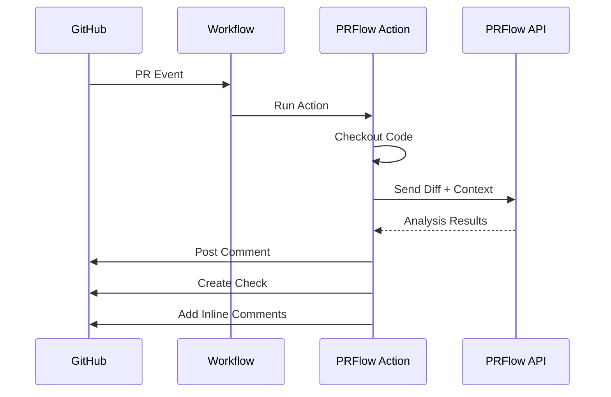

# GitHub Action

The PRFlow GitHub Action is the easiest way to add automated PR analysis to your repository. No infrastructure required.

## Quick Start

Add this workflow to your repository:

```yaml title=".github/workflows/prflow.yml"
name: PRFlow

on:
  pull_request:
    types: [opened, synchronize, reopened]

jobs:
  prflow:
    runs-on: ubuntu-latest
    permissions:
      contents: read
      pull-requests: write
      checks: write
    
    steps:
      - uses: actions/checkout@v4
      - uses: prflow/action@v1
        with:
          github-token: ${{ secrets.GITHUB_TOKEN }}
```

That's it! PRFlow will now analyze every pull request.

---

## How It Works



**What happens when a PR is opened:**

1. GitHub triggers the workflow
2. Action checks out your code
3. Diff and context sent to PRFlow API
4. Analysis runs (30-60 seconds)
5. Results posted as PR comment
6. Check status updated
7. Inline comments added for specific issues

---

## Configuration

### Full Example

```yaml title=".github/workflows/prflow.yml"
name: PRFlow

on:
  pull_request:
    types: [opened, synchronize, reopened, ready_for_review]
  pull_request_review_comment:
    types: [created]

jobs:
  prflow:
    # Don't run on drafts
    if: github.event.pull_request.draft == false
    
    runs-on: ubuntu-latest
    
    permissions:
      contents: read
      pull-requests: write
      checks: write
    
    steps:
      - name: Checkout
        uses: actions/checkout@v4
        with:
          fetch-depth: 0  # Full history for better analysis
      
      - name: Run PRFlow
        uses: prflow/action@v1
        id: prflow
        with:
          github-token: ${{ secrets.GITHUB_TOKEN }}
          
          # Agent configuration
          review-enabled: true
          test-generation: true
          doc-updates: false
          
          # Severity settings
          severity-threshold: medium
          block-on-critical: true
          fail-on-high: false
          
          # Output settings
          comment-on-pr: true
          max-comments: 25
          
          # Path filters
          ignore-paths: "dist/**,*.min.js,vendor/**"
      
      - name: Handle Results
        run: |
          echo "Risk Level: ${{ steps.prflow.outputs.risk-level }}"
          echo "Issues Found: ${{ steps.prflow.outputs.issues-found }}"
```

---

## Input Reference

### Required Inputs

| Input | Description |
|-------|-------------|
| `github-token` | GitHub token for API access. Use `${{ secrets.GITHUB_TOKEN }}` |

### Agent Inputs

| Input | Description | Default |
|-------|-------------|---------|
| `review-enabled` | Enable automated code review | `true` |
| `test-generation` | Enable test generation suggestions | `true` |
| `doc-updates` | Enable documentation suggestions | `true` |

### Severity Inputs

| Input | Description | Default |
|-------|-------------|---------|
| `severity-threshold` | Minimum severity to report (`low`, `medium`, `high`, `critical`) | `medium` |
| `block-on-critical` | Fail check if critical issues found | `true` |
| `fail-on-high` | Fail check if high severity issues found | `false` |

### Output Inputs

| Input | Description | Default |
|-------|-------------|---------|
| `comment-on-pr` | Post summary comment on PR | `true` |
| `max-comments` | Maximum number of inline comments | `25` |
| `inline-suggestions` | Post code suggestions inline | `true` |
| `collapse-low-severity` | Collapse low severity comments | `true` |

### Filter Inputs

| Input | Description | Default |
|-------|-------------|---------|
| `ignore-paths` | Comma-separated glob patterns to ignore | `""` |
| `include-paths` | Comma-separated glob patterns to include | `**/*` |
| `skip-labels` | Skip PRs with these labels | `skip-prflow,wip` |

### Advanced Inputs

| Input | Description | Default |
|-------|-------------|---------|
| `prflow-token` | PRFlow API key for advanced features | Optional |
| `prflow-endpoint` | Custom PRFlow API endpoint | `https://api.prflow.dev` |
| `dry-run` | Run analysis without posting results | `false` |
| `debug` | Enable debug logging | `false` |
| `config-file` | Path to custom config file | `.github/prflow.yml` |

---

## Output Reference

The action provides outputs you can use in subsequent steps:

| Output | Description | Example |
|--------|-------------|---------|
| `risk-level` | Overall risk assessment | `low`, `medium`, `high`, `critical` |
| `pr-type` | Detected PR type | `feature`, `bugfix`, `refactor` |
| `issues-found` | Total number of issues | `5` |
| `critical-count` | Critical severity issues | `0` |
| `high-count` | High severity issues | `1` |
| `medium-count` | Medium severity issues | `3` |
| `low-count` | Low severity issues | `1` |
| `tests-generated` | Number of test suggestions | `2` |
| `check-run-id` | ID of the created check run | `12345678` |
| `analysis-summary` | Brief summary text | `Found 5 issues...` |

### Using Outputs

```yaml
- uses: prflow/action@v1
  id: prflow
  with:
    github-token: ${{ secrets.GITHUB_TOKEN }}

# Use outputs in conditions
- name: Block on Critical
  if: steps.prflow.outputs.critical-count > 0
  run: |
    echo "Critical issues found!"
    exit 1

# Use outputs in notifications
- name: Slack Notification
  if: steps.prflow.outputs.risk-level == 'high'
  uses: slackapi/slack-github-action@v1
  with:
    payload: |
      {
        "text": "High risk PR needs review: ${{ github.event.pull_request.html_url }}"
      }
```

---

## Common Patterns

### Different Rules for Different Branches

```yaml
jobs:
  prflow-main:
    if: github.base_ref == 'main'
    runs-on: ubuntu-latest
    steps:
      - uses: prflow/action@v1
        with:
          github-token: ${{ secrets.GITHUB_TOKEN }}
          severity-threshold: low       # Catch everything
          block-on-critical: true
          fail-on-high: true             # Strict for main

  prflow-develop:
    if: github.base_ref == 'develop'
    runs-on: ubuntu-latest
    steps:
      - uses: prflow/action@v1
        with:
          github-token: ${{ secrets.GITHUB_TOKEN }}
          severity-threshold: medium     # Less strict
          block-on-critical: true
          fail-on-high: false
```

### Skip Specific PRs

```yaml
jobs:
  prflow:
    # Skip drafts, bots, and specific labels
    if: |
      github.event.pull_request.draft == false &&
      github.actor != 'dependabot[bot]' &&
      !contains(github.event.pull_request.labels.*.name, 'skip-prflow')
    
    steps:
      - uses: prflow/action@v1
        with:
          github-token: ${{ secrets.GITHUB_TOKEN }}
```

### Security-Only Review

```yaml
- uses: prflow/action@v1
  with:
    github-token: ${{ secrets.GITHUB_TOKEN }}
    review-enabled: true
    test-generation: false
    doc-updates: false
    severity-threshold: low
    # Only security issues will be flagged
```

### Matrix Strategy for Monorepos

```yaml
jobs:
  prflow:
    strategy:
      matrix:
        package: [api, web, core]
    
    steps:
      - uses: actions/checkout@v4
      
      - uses: prflow/action@v1
        with:
          github-token: ${{ secrets.GITHUB_TOKEN }}
          include-paths: "packages/${{ matrix.package }}/**"
```

### Manual Trigger

```yaml
on:
  workflow_dispatch:
    inputs:
      pr-number:
        description: 'PR number to analyze'
        required: true

jobs:
  prflow:
    steps:
      - uses: actions/checkout@v4
        with:
          ref: refs/pull/${{ inputs.pr-number }}/head
      
      - uses: prflow/action@v1
        with:
          github-token: ${{ secrets.GITHUB_TOKEN }}
```

---

## Configuration File

For more complex configurations, use a `.github/prflow.yml` file:

```yaml title=".github/prflow.yml"
# Agent settings
agents:
  analyzer:
    enabled: true
    risk_assessment: true
    suggest_reviewers: true
  
  reviewer:
    enabled: true
    categories:
      security: true
      bugs: true
      performance: true
      style: false
    severity_threshold: medium
    max_comments: 25
  
  test_generator:
    enabled: true
    framework: auto
    happy_path: true
    edge_cases: true
  
  documentation:
    enabled: false

# Path filters
paths:
  include:
    - 'src/**'
    - 'lib/**'
  exclude:
    - '**/*.test.ts'
    - '**/*.spec.ts'
    - 'dist/**'
    - 'node_modules/**'

# Output settings
outputs:
  summary_comment:
    enabled: true
    template: default
  
  inline_comments:
    enabled: true
    max: 25
    use_suggestions: true
  
  check_status:
    enabled: true
    fail_on:
      critical: true
      high: false
```

Reference it in your workflow:

```yaml
- uses: prflow/action@v1
  with:
    github-token: ${{ secrets.GITHUB_TOKEN }}
    config-file: .github/prflow.yml
```

---

## Permissions

The action requires these permissions:

| Permission | Required For |
|------------|--------------|
| `contents: read` | Reading repository files |
| `pull-requests: write` | Posting comments |
| `checks: write` | Creating check runs |

### Fine-Grained Token

If using a fine-grained personal access token:

- **Repository access:** Read access to code, metadata
- **Pull requests:** Read and write
- **Checks:** Read and write

---

## Troubleshooting

### Action Not Running

**Symptoms:** Workflow doesn't trigger on PR events

**Check:**
1. Workflow file is in `.github/workflows/`
2. PR types are correct (`opened`, `synchronize`, `reopened`)
3. Branch matches workflow trigger conditions

### No Comments Posted

**Symptoms:** Analysis runs but no PR comment appears

**Check:**
1. `comment-on-pr: true` in config
2. `pull-requests: write` permission granted
3. No errors in action logs

### Check Not Created

**Symptoms:** No check status on PR

**Check:**
1. `checks: write` permission granted
2. Action completed successfully
3. `dry-run` is not enabled

### Rate Limiting

**Symptoms:** Action fails with rate limit error

**Solution:**
```yaml
- uses: prflow/action@v1
  with:
    github-token: ${{ secrets.GITHUB_TOKEN }}
    max-comments: 10  # Reduce API calls
```

---

## Self-Hosted Runners

PRFlow works with self-hosted runners:

```yaml
jobs:
  prflow:
    runs-on: self-hosted
    
    steps:
      - uses: actions/checkout@v4
      - uses: prflow/action@v1
        with:
          github-token: ${{ secrets.GITHUB_TOKEN }}
          # Use your PRFlow instance
          prflow-endpoint: https://prflow.internal.company.com
```

---

## Next Steps

- [**Configuration Reference**](/docs/guides/configuration) — All config options
- [**Workflows**](/docs/concepts/workflows) — Customize processing
- [**Self-Hosting**](/docs/guides/self-hosting) — Run your own instance
