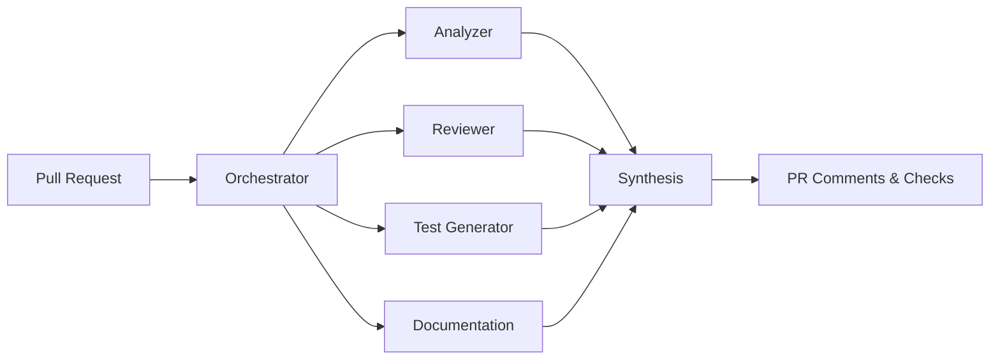

# PRFlow

**Automate 70% of your PR review work.**

PRFlow is an end-to-end pull request automation platform that handles code analysis, review, test generation, documentation updates, and merge orchestration—so your team can focus on what matters.

```yaml title=".github/workflows/prflow.yml"
name: PRFlow
on:
  pull_request:
    types: [opened, synchronize]

jobs:
  prflow:
    runs-on: ubuntu-latest
    permissions:
      contents: read
      pull-requests: write
      checks: write
    steps:
      - uses: actions/checkout@v4
      - uses: prflow/action@v1
        with:
          github-token: ${{ secrets.GITHUB_TOKEN }}
```

That's it. Every PR now gets automated analysis, review comments, and test suggestions.

---

## The Problem

Code review is essential—but the way it's practiced today is broken.

| Metric | Industry Average | Impact |
|--------|------------------|--------|
| Time to first review | 24-48 hours | Blocks dependent work |
| Review cycles per PR | 2.3 | Context switching overhead |
| Developer time on review | 4-6 hours/week | Senior engineers bottlenecked |
| PRs abandoned | 15% | Wasted development effort |

The paradox: humans spend time on mechanical checks (style, obvious bugs, missing tests) while architectural and business logic issues slip through.

**PRFlow flips this.** AI handles the mechanical 70%. Humans focus on the 30% that requires judgment.

---

## What PRFlow Does

### 🔍 Analyzes Every Change

PRFlow understands *what* changed and *why* it matters:

- **Semantic detection** — New functions, modified APIs, config changes
- **Impact radius** — Which files and systems are affected
- **Risk assessment** — Low, medium, high, or critical
- **PR classification** — Feature, bugfix, refactor, docs, chore

### 🐛 Reviews for Real Issues

Not style nitpicks. Actual problems:

- **Security** — SQL injection, XSS, hardcoded secrets, auth bypass
- **Bugs** — Null pointer risks, off-by-one errors, race conditions
- **Performance** — N+1 queries, memory leaks, blocking I/O
- **Error handling** — Empty catch blocks, unhandled promises

Each issue includes severity, explanation, and a suggested fix.

### 🧪 Generates Tests

New function? PRFlow suggests tests:

```typescript
// PRFlow detected: validateEmail() added in src/utils/validation.ts
// Suggested tests:

describe('validateEmail', () => {
  it('returns true for valid email formats', () => {
    expect(validateEmail('user@example.com')).toBe(true);
    expect(validateEmail('name+tag@domain.co.uk')).toBe(true);
  });

  it('returns false for invalid formats', () => {
    expect(validateEmail('not-an-email')).toBe(false);
    expect(validateEmail('@missing-local.com')).toBe(false);
  });

  it('handles edge cases', () => {
    expect(validateEmail('')).toBe(false);
    expect(validateEmail(null)).toBe(false);
  });
});
```

Supports Jest, Vitest, pytest, and Go testing.

### 👥 Suggests the Right Reviewers

Based on:
- Code ownership (who touched these files before)
- Domain expertise (security changes → security team)
- Current workload (don't pile on the same person)

### 📝 Keeps Docs in Sync

- Generates JSDoc for new public APIs
- Flags outdated README sections
- Suggests changelog entries

---

## How It Works

PRFlow uses a multi-agent architecture. Each agent specializes in one task:



Agents run in parallel. Results are synthesized into a single, coherent report. Total processing time: typically under 60 seconds.

---

## Two Ways to Use PRFlow

### GitHub Action (Recommended)

Zero infrastructure. Add a workflow file and you're done.

```yaml
- uses: prflow/action@v1
  with:
    github-token: ${{ secrets.GITHUB_TOKEN }}
```

### Self-Hosted

Full control. Run on your own infrastructure.

```bash
git clone https://github.com/josedab/prflow.git
docker compose up -d
```

---

## What Teams Say

> "PRFlow catches the issues we'd normally find in the second or third review round. Our cycle time dropped by 40%."

> "The test generation alone saves us hours per week. And it actually writes good tests."

> "Finally, a tool that doesn't just complain about formatting."

---

## Get Started

**Option 1: Quick start (2 minutes)**

Add the GitHub Action to your repo. [→ Quick Start Guide](/docs/getting-started/quickstart)

**Option 2: Full setup (15 minutes)**

Configure a GitHub App for advanced features. [→ Installation Guide](/docs/getting-started/installation)

**Option 3: Self-host**

Deploy on your own infrastructure. [→ Self-Hosting Guide](/docs/guides/self-hosting)

---

## Learn More

- [**Architecture**](/docs/concepts/architecture) — How the multi-agent system works
- [**Configuration**](/docs/guides/configuration) — Customize PRFlow for your team
- [**API Reference**](/docs/api-reference) — Programmatic access to all features
- [**FAQ**](/docs/faq) — Common questions answered
